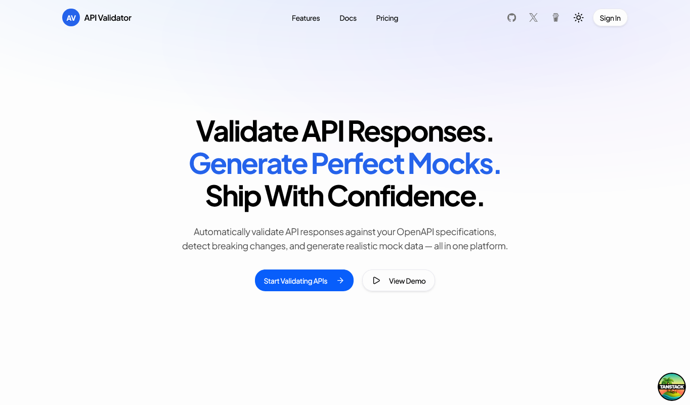

# API Response Validator & Mock Generator

[](https://portfolio-code-workspace.vercel.app/)
[](https://github.com/ingfranciscastillo/api-response-validator-mock-generator/stargazers)
[](LICENSE)
[](https://github.com/ingfranciscastillo/api-response-validator-mock-generator/commits/main)

<!-- README-I18N:START -->

[English](./README.md) | **Español**

<!-- README-I18N:END -->



Plataforma SaaS full-stack para equipos de API. Valida respuestas contra especificaciones OpenAPI, genera datos mock realistas y detecta desviaciones de contrato. Construida con TanStack Start, React 19 y Neon Postgres — diseñada para equipos que distribuyen APIs y necesitan detectar cambios disruptivos antes de que lleguen a producción.

## Características

- **Validación de Respuestas** — Envía peticiones a tu API y valida las respuestas contra especificaciones OpenAPI/Swagger (2.0, 3.0, 3.1) con reportes estructurados de violaciones.
- **Generación de Mocks** — Genera payloads realistas a partir de definiciones de esquema usando plantillas basadas en faker, incluyendo variantes de casos límite y error.
- **Detección de Desviaciones** — Trabajos programados en segundo plano que consultan tus endpoints y comparan las respuestas en vivo contra tus especificaciones, revelando cambios disruptivos y diferencias.
- **Gestión de Especificaciones** — Importa especificaciones mediante carga de archivos, pegado de texto o desde una URL. Examina endpoints con un visor interactivo de árbol de esquemas. Compara versiones lado a lado.
- **Exportación de Reportes** — Exporta resultados de validación como HTML, PDF o JSON.
- **Multiinquilino por Espacio de Trabajo** — Equipos organizacionales con control de acceso basado en roles (propietario, administrador, miembro).
- **Modo Oscuro** — Soporte integrado de modo oscuro con alternancia según la preferencia del sistema.

## ¿Qué Hace Esto?

Cada cambio en una API conlleva un riesgo. Un campo faltante, una propiedad renombrada o un cuerpo de respuesta que ya no coincide con la especificación puede romper a los consumidores — aplicaciones móviles, integraciones de terceros, microservicios internos. Esta plataforma ofrece a los equipos de API una red de seguridad:

- **Valida** respuestas en vivo contra tu especificación OpenAPI y obtén reportes estructurados de violaciones antes de lanzar.
- **Genera** payloads mock realistas directamente desde tu esquema para que los consumidores puedan desarrollar con datos precisos.
- **Detecta** desviaciones de contrato automáticamente — trabajos programados comparan tus endpoints en vivo contra tu especificación y te alertan cuando algo cambia.

Piénsalo como un pipeline CI/CD para contratos de API: detecta problemas temprano, lanza con confianza.

## Stack Tecnológico

| Capa | Tecnología |
|------|-----------|
| **Framework** | [TanStack Start](https://tanstack.com/start) (SSR, funciones de servidor, enrutamiento basado en archivos) |
| **Enrutamiento** | [TanStack Router](https://tanstack.com/router) (type-safe) |
| **Estado** | [TanStack Query](https://tanstack.com/query), [TanStack Form](https://tanstack.com/form), [TanStack Table](https://tanstack.com/table) |
| **UI** | React 19, Tailwind CSS v4, [shadcn/ui](https://ui.shadcn.com/), Radix UI, Lucide icons |
| **Gráficos** | Recharts |
| **Base de Datos** | Neon (Postgres serverless) + [Drizzle ORM](https://orm.drizzle.team) |
| **Autenticación** | [Better Auth](https://www.better-auth.com) (email/contraseña, OAuth GitHub/Google, organizaciones) |
| **Validación** | AJV, ajv-formats, @apidevtools/swagger-parser |
| **Datos Mock** | json-schema-faker + @faker-js/faker |
| **Tareas Programadas** | Inngest (cron de detección de desviaciones, alertas) |
| **Almacenamiento** | Cloudflare R2 (compatible S3 para especificaciones grandes, exportaciones) |
| **Linting** | Biome |
| **Pruebas** | Vitest |

## Primeros Pasos

### Requisitos Previos

- [Node.js](https://nodejs.org/) >= 20
- [pnpm](https://pnpm.io/) >= 9
- Una base de datos [Neon](https://neon.tech) Postgres (o cualquier base compatible con Postgres)

### Instalación

```bash
git clone https://github.com/ingfranciscastillo/api-response-validator-mock-generator.git
cd api-response-validator-mock-generator
pnpm install
```

### Variables de Entorno

Copia `.env.local.example` a `.env.local` y completa los valores:

| Variable | Descripción |
|----------|-------------|
| `DATABASE_URL` | Cadena de conexión a Neon Postgres (con pool) |
| `DATABASE_URL_UNPOOLED` | Conexión directa a Neon Postgres (para migraciones) |
| `BETTER_AUTH_SECRET` | Secreto de autenticación (genera con `pnpm dlx @better-auth/cli secret`) |
| `BETTER_AUTH_URL` | URL de la aplicación para callbacks de autenticación |
| `APP_URL` | URL base de la aplicación |
| `R2_*` | Credenciales de Cloudflare R2 (opcional, para archivos grandes) |
| `INNGEST_*` | Event key y signing key de Inngest (opcional, para detección de desviaciones) |

### Base de Datos

```bash
pnpm db:generate    # Genera migraciones SQL
pnpm db:migrate     # Aplica migraciones a la base de datos
pnpm db:push        # Aplica cambios de esquema directamente (solo desarrollo)
```

### Desarrollo

```bash
pnpm dev
```

Abre en [http://localhost:3000](http://localhost:3000).

### Producción

```bash
pnpm build
pnpm preview
```

### Pruebas

```bash
pnpm test
```

## Uso

### 1. Importar una Especificación OpenAPI

Navega a **Specs** → **New Spec**. Sube un archivo JSON/YAML, pega el contenido o obténlo desde una URL. El parser soporta OpenAPI 2.0, 3.0 y 3.1.

### 2. Validar Respuestas

Ve al **Validation Workspace**, selecciona una especificación y un endpoint, luego configura tu petición:

- Establece el método HTTP y la URL base
- Completa los parámetros de ruta/consulta y cabeceras
- Proporciona un cuerpo de petición (para POST/PUT/PATCH)
- Haz clic en **Send Request**

El motor ejecuta la respuesta a través de AJV contra el esquema de tu especificación y devuelve un resultado estructurado con violaciones agrupadas por severidad.

### 3. Generar Mocks

Desde la página **Mocks**, selecciona una versión de la especificación y el código de estado de respuesta objetivo. El generador construye payloads a partir de las propiedades del esquema — primero los campos requeridos, luego los opcionales, más variantes de error y casos límite.

### 4. Monitorear Desviaciones

Configura **Monitored Specs** para que Inngest consulte tus endpoints periódicamente. Cuando una respuesta en vivo difiere de la especificación, recibirás una alerta de desviación con un diff detallado.

## Estructura del Proyecto

```
src/
├── routes/              # Enrutamiento basado en archivos
│   ├── dashboard/       # Dashboard protegido (specs, validación, mocks, desviaciones, reportes, equipo, ajustes)
│   ├── login.tsx        # Páginas de autenticación
│   └── ...
├── components/          # Componentes UI
│   ├── ui/              # Primitivas shadcn/ui
│   ├── validation/      # ValidationRequestBuilder, ValidationResultCard, DiffViewer
│   ├── specs/           # EndpointExplorer, SchemaTreeViewer
│   ├── mocks/           # Visor de payloads mock, reglas de generación
│   ├── dashboard/       # Tarjetas de estadísticas, gráficos, tablas
│   └── landing/         # Páginas de marketing
├── db/
│   ├── schema/          # Esquemas Drizzle por dominio (auth, spec, validation, mocks, drift, report, audit)
│   └── index.ts         # Cliente de base de datos
├── lib/
│   ├── specs/           # Importación, análisis y CRUD de especificaciones (funciones de servidor)
│   ├── validation/      # Motor de validación, lógica de diff (funciones de servidor)
│   ├── mocks/           # Generación de mocks (funciones de servidor)
│   └── auth/            # Helpers de autenticación del lado del servidor
└── integrations/        # Cliente de autenticación, proveedor de TanStack Query
```

## Documentación

La documentación completa de diseño y arquitectura está disponible en el directorio [`docs/`](./docs/):

- [Arquitectura](./docs/architecture.md)
- [Esquema de Base de Datos](./docs/database.md)
- [Autenticación y Permisos](./docs/auth_and_permissions.md)
- [Referencia de API](./docs/api_spec.md)
- [Librería de Componentes](./docs/components.md)
- [Sistema de Diseño](./docs/design_system.md)
- [Hoja de Ruta](./docs/roadmap.md)